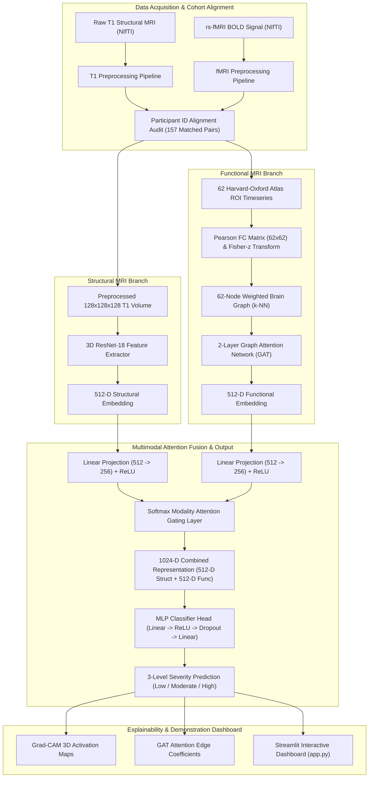

# Technical Architecture Document

**Project Title:** 3-Level Autism Severity Detection Using Multimodal MRI  
**Repository Location:** `d:\Projects\MRI_Autism\mri 2`  
**Status:** Completed Academic Research Architecture  
**Document Version:** 1.0  

---

## 1. System Overview & End-to-End Data Flow

The technical architecture is structured around a dual-stream deep learning pipeline that processes structural 3D T1-weighted MRI volumes and resting-state functional MRI (rs-fMRI) graph networks, fusing them through a Softmax Modality Attention Gating layer for 3-class autism severity classification.



---

## 2. Component Pipeline Architecture

### 2.1 Structural MRI Branch (3D ResNet-18)
- **Source Script**: `src/preprocess_t1.py`, `src/extract_157_structural_embeddings.py`, `src/models/resnet3d.py`
- **Input**: Raw 3D T1 NIfTI volumes (`data/raw/abide2_t1/*.nii.gz`).
- **Preprocessing Pipeline**:
  1. N4 Bias Field Correction for intensity inhomogeneity.
  2. Skull stripping and brain tissue extraction.
  3. Spatial registration to MNI152 template space.
  4. Resampling to fixed $128 \times 128 \times 128$ voxel grid.
  5. Voxel-level Z-score intensity normalization.
- **Model Architecture**:
  - 3D Convolutional Stem ($7\times7\times7$, stride 2, 64 channels) $\rightarrow$ 3D MaxPool.
  - 4 Residual Layer blocks with 3D convolutions ($64 \rightarrow 128 \rightarrow 256 \rightarrow 512$ channels).
  - 3D Adaptive Average Pooling $\rightarrow$ 512-dimensional feature vector.
- **Checkpoint Location**: `models/checkpoints/best_resnet3d.pth`
- **Embedding Output**: `results/structural_embeddings_157.csv` ($157 \times 512$).

### 2.2 Functional MRI Branch (62-Node GAT)
- **Source Script**: `src/preprocess_fmri.py`, `src/extract_roi_timeseries.py`, `src/build_functional_connectivity.py`, `src/build_brain_graphs.py`, `src/train_gat.py`
- **Input**: rs-fMRI BOLD volumes (`data/raw/abide2_fmri/`).
- **Preprocessing Pipeline**:
  1. Head motion correction & Friston 24-parameter regression.
  2. Cerebrospinal Fluid (CSF) & White Matter (WM) nuisance signal regression.
  3. Motion scrubbing ($FD > 0.5\text{mm}$).
  4. TR-adapted bandpass temporal filtering ($0.01\text{Hz} - 0.1\text{Hz}$).
- **Graph Construction**:
  - Parcellation using 62 Harvard-Oxford atlas ROIs (48 cortical, 14 subcortical).
  - Extraction of $T \times 62$ BOLD time-series (`data/features/fmri/roi_primary/`).
  - Pearson correlation matrix computation + Fisher-z transform: $z = 0.5 \cdot \ln\left(\frac{1+r}{1-r}\right)$.
  - Construction of 62-node weighted PyTorch Geometric graph objects (`data/features/fmri_graphs/`).
- **Model Architecture**:
  - Layer 1: 2-head Graph Attention Layer (`GATConv`, $62 \rightarrow 128$ dims per head $= 256$).
  - Layer 2: 2-head Graph Attention Layer (`GATConv`, $256 \rightarrow 256$ dims).
  - Global Mean & Max Pooling $\rightarrow$ 512-dimensional functional embedding vector.
- **Checkpoint Location**: `models/fmri_gat/best_gat_model.pt`
- **Embedding Output**: `results/gat_embeddings/functional_embeddings.csv` ($157 \times 512$).

### 2.3 Multimodal Attention Fusion Architecture
- **Source Script**: `src/train_step11f_multimodal.py`
- **Input**: Matched structural 512-D embedding + functional 512-D embedding (`results/multimodal/final_aligned_embeddings_157.csv`).
- **Fusion Logic**:
  1. **Projection Heads**:
     $$\mathbf{h}_{\text{struct}} = \text{ReLU}(\mathbf{W}_{\text{s}} \mathbf{e}_{\text{struct}} + \mathbf{b}_{\text{s}}) \quad \in \mathbb{R}^{256}$$
     $$\mathbf{h}_{\text{func}} = \text{ReLU}(\mathbf{W}_{\text{f}} \mathbf{e}_{\text{func}} + \mathbf{b}_{\text{f}}) \quad \in \mathbb{R}^{256}$$
  2. **Modality Attention Gating**:
     $$a_{\text{struct}} = \mathbf{v}_{\text{s}}^\top \mathbf{h}_{\text{struct}}, \quad a_{\text{func}} = \mathbf{v}_{\text{f}}^\top \mathbf{h}_{\text{func}}$$
     $$[\alpha_{\text{struct}}, \alpha_{\text{func}}] = \text{Softmax}([a_{\text{struct}}, a_{\text{func}}])$$
  3. **Gated Concatenation**:
     $$\mathbf{z}_{\text{fused}} = [\alpha_{\text{struct}} \cdot \mathbf{e}_{\text{struct}} \;\|\; \alpha_{\text{func}} \cdot \mathbf{e}_{\text{func}}] \quad \in \mathbb{R}^{1024}$$
  4. **Classifier Head**:
     $$\text{Logits} = \text{Linear}_{256 \rightarrow 3}(\text{Dropout}_{0.3}(\text{ReLU}(\text{Linear}_{1024 \rightarrow 256}(\mathbf{z}_{\text{fused}}))))$$
- **Checkpoint Location**: `models/multimodal/best_multimodal_attention.pt`

---

## 3. Data Integrity & Participant Alignment Protocols

### 3.1 Strict String Matching on `participant_id`
All data loading across structural embeddings, functional embeddings, NIfTI files, predictions, and explainability heatmaps is governed by explicit string matching on `participant_id`. Dataframe row positions or implicit array orderings are strictly prohibited.

```python
# Data Integrity Lookup Pattern
matching_rows = df[df["participant_id"].astype(str) == str(selected_pid)]
```

### 3.2 Verified Split Distribution
To eliminate data leakage, the split assignment is frozen in `data/phenotypic/split_master_manifest.csv`:
- **Training Set (N = 102)**: Used exclusively for gradient updates.
- **Validation Set (N = 25)**: Used for hyperparameter tuning & early stopping.
- **Held-Out Test Set (N = 30)**: Frozen held-out set evaluated only once after final model selection.

---

## 4. Key Checkpoints & Artifact Directory Registry

| Artifact Description | Directory Location | Primary Contents / Schema |
| :--- | :--- | :--- |
| **3D ResNet-18 Weights** | `models/checkpoints/best_resnet3d.pth` | PyTorch state dictionary for 3D ResNet-18 feature extractor |
| **GAT Model Weights** | `models/fmri_gat/best_gat_model.pt` | PyTorch Geometric state dictionary for 2-layer GAT |
| **Multimodal Model Weights** | `models/multimodal/best_multimodal_attention.pt` | PyTorch state dictionary for Attention Fusion model |
| **Aligned Embeddings** | `results/multimodal/final_aligned_embeddings_157.csv` | 157 subjects $\times$ (1024-D features + split + severity_class) |
| **Held-Out Test Predictions** | `results/multimodal/test_predictions.csv` | 30 test subjects $\times$ (true_class, predicted_class, attention weights) |
| **Final Test Metrics** | `results/multimodal/final_metrics.json` | Test accuracy (0.4000), Macro F1 (0.3592), class metrics |
| **GAT Important Regions** | `results/explainability/gat_important_regions.csv` | Top ROI centrality rankings from GAT attention coefficients |
| **GAT Important Edges** | `results/explainability/gat_important_connections.csv` | Top edge connection attention coefficients per participant |
| **Grad-CAM Activations** | `results/gradcam/regional_activations_summary.csv` | Cortical & subcortical 3D Grad-CAM importance scores |

---

## 5. Streamlit Frontend Architecture (`app.py`)

The Streamlit web application acts as an interactive demonstration interface with zero online model inference:

```
app.py (Streamlit Application)
  ├── Page Config & Custom Dark Navy CSS Theme (#0b0f19 background, #121829 cards)
  ├── @st.cache_data Artifact Loader (load_project_artifacts())
  ├── @st.cache_data Authentic NIfTI Volume Loader (load_nifti_volume_by_pid())
  ├── Central Participant State Management (st.session_state["selected_subject_id"])
  └── 8 Interactive Workspace Navigation Views:
        ├── 🏠 Main Dashboard
        ├── 🔬 VisualNeuro (Advanced Workspace)
        ├── 👥 State Viewer (Dynamic 3-Subject Comparison)
        ├── 🌐 Functional Connectivity & Graph Analysis
        ├── 🎯 Test Set Predictions (30 Subjects)
        ├── 📈 Performance & Benchmarks
        ├── 📊 Dataset & Cohort Analysis
        └── ⚠️ Research Disclaimers & Ethics
```

### Error Handling & Missing-Data Behavior
- **Missing NIfTI File**: Displays `MRI volume unavailable for Subject {pid}` with yellow warning box (no synthetic brain generation).
- **Missing GAT Attention**: Displays `GAT attention coefficients unavailable for Subject {pid}` and automatically renders the subject's authentic 62×62 Fisher-z Functional Connectivity Graph.
- **Missing Prediction**: Displays `Not in held-out test set (Train/Val subject)`.

---

## 6. Execution & Dependencies

### Runtime Dependencies
- Python 3.10+
- PyTorch 2.0+ & PyTorch Geometric
- Nibabel (NIfTI I/O)
- Streamlit 1.56+
- Matplotlib, Pandas, NumPy, Scikit-Learn

### Standard Commands
```bash
# Launch Interactive Web Dashboard
streamlit run app.py

# Compile Check
python -m py_compile app.py

# Run Full Evaluation Audit
python src/step12_final_evaluation.py
```
